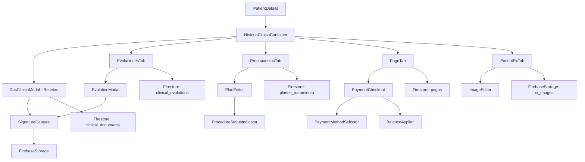

# Design Document

## Overview

Este documento de diseño técnico describe las mejoras al sistema de gestión odontológica OdontoCloud. El diseño abarca seis nuevas funcionalidades para optimizar la gestión de recetas médicas, evoluciones, presupuestos y pagos, además de cinco correcciones críticas para problemas existentes.

### Alcance del Diseño

El sistema OdontoCloud es una aplicación web React basada en Firebase/Firestore con arquitectura de componentes funcionales y hooks. Las mejoras se integran dentro de la arquitectura existente, extendiendo los módulos de pacientes, evoluciones, presupuestos y pagos sin afectar otros subsistemas.

**Tecnologías principales:**
- Frontend: React 18.2 con Hooks y Context API
- Routing: React Router DOM v6
- Forms: React Hook Form con validación Zod
- Styling: Tailwind CSS
- Backend: Firebase (Firestore, Storage, Auth)
- State Management: Context API + hooks locales
- UI Components: React Icons, Framer Motion

### Principios de Diseño

1. **Inmutabilidad**: Las evoluciones clínicas son inmutables una vez creadas; solo se permite agregar firmas digitales
2. **Trazabilidad**: Todas las operaciones críticas (anulaciones, ediciones) deben registrar usuario, fecha y motivo
3. **Validación reactiva**: Validaciones en tiempo real usando React Hook Form y Zod schemas
4. **Optimización de consultas**: Uso de índices compuestos en Firestore y paginación donde sea necesario
5. **Experiencia de usuario fluida**: Feedback inmediato, indicadores de carga, y transiciones suaves

## Architecture

### Diagrama de Componentes



### Arquitectura de Capas

**Capa de Presentación (Components)**
- `components/`: Componentes UI reutilizables
- `modules/pacientes/components/`: Componentes específicos del módulo de pacientes
- Uso extensivo de compound components para modales y formularios complejos

**Capa de Lógica de Negocio (Hooks + Services)**
- `hooks/`: Custom hooks para lógica compartida (useAuth, usePatientsSWR, useOdontograma)
- `services/`: Servicios que encapsulan operaciones de Firestore (patientService, evolutionService, clinicalService)

**Capa de Datos (Firebase)**
- Firestore: Base de datos NoSQL con colecciones y subcolecciones
- Firebase Storage: Almacenamiento de imágenes (firmas digitales, radiografías)
- Firebase Auth: Autenticación y autorización

**Gestión de Estado**
- Context API para estado global (AuthContext, ToastContext)
- React Hook Form para estado de formularios
- useState/useEffect para estado local de componentes

## Components and Interfaces

### Nuevos Componentes

#### 1. SignatureCapture Component

Componente de captura de firma digital usando canvas HTML5.

**Props Interface:**
```typescript
interface SignatureCaptureProps {
  isOpen: boolean;
  onClose: () => void;
  onSave: (signatureDataURL: string) => Promise<void>;
  title?: string;
  doctorName: string;
}
```

**Features:**
- Canvas responsivo con soporte para mouse y touch
- Funcionalidad de limpiar y rehacer
- Exportación a data URL (PNG base64)
- Preview de la firma antes de guardar

**Location:** `src/components/shared/SignatureCapture.jsx`

---

#### 2. ProcedureStatusIndicator Component

Indicador visual del estado de procedimientos en presupuestos.

**Props Interface:**
```typescript
interface ProcedureStatusIndicatorProps {
  status: 'pending' | 'completed';
  completedDate?: string;
  procedure: {
    id: string;
    desc: string;
    amount: number;
    qty: number;
  };
}
```

**Visual States:**
- Pendiente: Círculo gris con borde punteado
- Realizado: Círculo verde con checkmark + fecha

**Location:** `src/modules/pacientes/components/ProcedureStatusIndicator.jsx`

---

#### 3. DebtAlertBanner Component

Banner de alerta para procedimientos realizados no cancelados.

**Props Interface:**
```typescript
interface DebtAlertBannerProps {
  totalDebt: number;
  procedureCount: number;
  onPaymentClick: () => void;
}
```

**Location:** `src/modules/pacientes/components/DebtAlertBanner.jsx`

---

#### 4. PaymentDeletionModal Component

Modal para justificar anulación de pagos con validación obligatoria.

**Props Interface:**
```typescript
interface PaymentDeletionModalProps {
  isOpen: boolean;
  payment: Payment;
  onConfirm: (justification: string) => Promise<void>;
  onCancel: () => void;
}
```

**Validations:**
- Mínimo 10 caracteres en justificación
- Campo obligatorio antes de confirmar

**Location:** `src/modules/pacientes/components/PaymentDeletionModal.jsx`

---

#### 5. ImageEditor Component

Editor de imágenes de radiografías con soporte de versiones.

**Props Interface:**
```typescript
interface ImageEditorProps {
  image: {
    id: string;
    url: string;
    path: string;
    name: string;
  };
  onSave: (newFile: File) => Promise<void>;
  onCancel: () => void;
}
```

**Features:**
- Reemplazo de imagen existente
- Historial de versiones
- Metadata preservation

**Location:** `src/modules/pacientes/components/ImageEditor.jsx`

---

### Componentes Modificados

#### 1. DocClinicoModal (Recetas Médicas)

**Cambios:**
- Agregar campos `frecuenciaDiaria` y `duracionDias` para cada medicamento
- Calcular automáticamente `cantidad = frecuenciaDiaria × duracionDias`
- Permitir override manual de cantidad calculada
- Agregar botón de firma digital en columna de acciones
- Integrar SignatureCapture component

**New State:**
```javascript
const [recetaItems, setRecetaItems] = useState([
  {
    principioActivo: string,
    marca: string,
    concentracion: string,
    presentacion: string,
    frecuenciaDiaria: number,    // NUEVO
    duracionDias: number,          // NUEVO
    cantidad: number,              // AUTO-CALCULADO
    cantidadOverride: boolean,     // NUEVO
    viaAdministracion: string,
    indicaciones: string,
    doctorSignature: string | null, // NUEVO: Data URL de firma
    signedAt: string | null,        // NUEVO: ISO timestamp
    signedBy: string | null         // NUEVO: UID del doctor
  }
]);
```

---

#### 2. EvolucionesTab + EvolutionModal

**Cambios:**
- Agregar botón de firma digital en lista de evoluciones
- Integrar SignatureCapture component
- Almacenar firma en Firestore como data URL
- Mostrar firma en vista de impresión
- Mantener inmutabilidad post-firma

**New Fields in Evolution Document:**
```javascript
{
  // ... existing fields
  doctorSignature: string | null,  // Data URL
  signedAt: Timestamp | null,
  signedBy: string | null          // Doctor UID
}
```

---

#### 3. PlanEditor (Presupuestos)

**Cambios:**
- Agregar campo `realizado: boolean` a cada item del plan
- Agregar campo `fechaRealizado: string | null` (ISO)
- Agregar indicador visual ProcedureStatusIndicator
- Agregar filtro por estado (pendiente/realizado)
- Calcular y mostrar porcentaje de completitud
- Integrar DebtAlertBanner cuando existan deudas
- Fix: Validar que el botón "Guardar" funcione correctamente
- Fix: Validar descuentos después de cargar ítems

**Updated Item Schema:**
```javascript
{
  id: string,
  desc: string,
  amount: number,
  qty: number,
  descuento: number,
  realizado: boolean,           // NUEVO
  fechaRealizado: string | null, // NUEVO
  marcadoPor: string | null,     // NUEVO: UID del usuario
  line_obs: string
}
```

**New Computed Properties:**
```javascript
const totalItems = plan.items.length;
const itemsRealizados = plan.items.filter(i => i.realizado).length;
const porcentajeCompletitud = (itemsRealizados / totalItems) * 100;

const itemsRealizadosNoPagados = plan.items.filter(i => {
  const totalCost = (i.amount * i.qty) - i.descuento;
  const paid = getPaidAmount(i.id);
  return i.realizado && (totalCost > paid);
});
const totalDeuda = itemsRealizadosNoPagados.reduce((sum, i) => {
  const totalCost = (i.amount * i.qty) - i.descuento;
  const paid = getPaidAmount(i.id);
  return sum + (totalCost - paid);
}, 0);
```

---

#### 4. PagoTab

**Cambios:**
- Mostrar campo `referencia` condicionalmente según medio de pago
- Validar referencia obligatoria para medios que la requieren
- Mejorar lógica de aplicación de saldo a favor
- Aplicar solo el monto necesario (no exceder valor de procedimientos)
- Integrar PaymentDeletionModal para anulaciones
- Pre-seleccionar procedimientos realizados no cancelados

**Updated Payment Document Schema:**
```javascript
{
  id: string,
  patientId: string,
  patientNombre: string,
  monto: number,
  medio: string,
  referencia: string | null,      // MODIFICADO: Condicional
  concepto: string,
  profesional: string,
  notas: string,
  fecha: Timestamp,
  fechaISO: string,
  inquilino: string,
  registradoPor: string,
  estado: 'Completado' | 'Anulado',
  planId?: string,
  itemPayments?: Array<{
    itemId: string,
    desc: string,
    monto: number
  }>,
  // NUEVOS campos para anulación
  anuladoEn?: Timestamp,
  anuladoPor?: string,
  motivoAnulacion?: string
}
```

**Lógica de Saldo a Favor:**
```javascript
// Aplicar solo el mínimo necesario
const montoAAplicar = Math.min(saldoAFavorDisponible, valorTotalProcedimientos);
const nuevoSaldo = saldoAFavorDisponible - montoAAplicar;
```

---

#### 5. PatientRxTab (Radiografías)

**Cambios:**
- Agregar botón "Editar" en acciones de cada imagen
- Integrar ImageEditor component
- Mantener historial de versiones en Firestore
- Registrar metadata de edición (usuario, fecha)

**Updated Image Schema:**
```javascript
{
  url: string,
  path: string,
  name: string,
  title: string,
  descripcion: string,
  profesional: string,
  creador: string,
  fechaAsocISO: string,
  type: string,
  size: number,
  uploadedAtMS: number,
  uploadedAtISO: string,
  // NUEVOS campos
  versiones?: Array<{
    url: string,
    path: string,
    editadoEn: string,
    editadoPor: string,
    versionNumero: number
  }>,
  ultimaEdicion?: {
    fecha: string,
    usuario: string
  }
}
```

---

### Custom Hooks

#### useSignatureCapture

Hook para manejar la lógica de captura de firmas.

```javascript
const useSignatureCapture = () => {
  const canvasRef = useRef(null);
  const [isDrawing, setIsDrawing] = useState(false);
  const [isEmpty, setIsEmpty] = useState(true);
  
  const startDrawing = (e) => { /* ... */ };
  const draw = (e) => { /* ... */ };
  const stopDrawing = () => { /* ... */ };
  const clear = () => { /* ... */ };
  const getSignatureDataURL = () => { /* ... */ };
  
  return {
    canvasRef,
    isEmpty,
    startDrawing,
    draw,
    stopDrawing,
    clear,
    getSignatureDataURL
  };
};
```

#### usePaymentMethods

Hook para cargar métodos de pago dinámicos desde configuración.

```javascript
const usePaymentMethods = (inquilino) => {
  const [methods, setMethods] = useState([]);
  const [loading, setLoading] = useState(true);
  
  useEffect(() => {
    const loadMethods = async () => {
      const q = query(
        collection(db, "metodos_pago"),
        where("inquilino", "==", inquilino),
        where("activo", "==", true)
      );
      const snap = await getDocs(q);
      setMethods(snap.docs.map(d => d.data().nombre));
      setLoading(false);
    };
    loadMethods();
  }, [inquilino]);
  
  return { methods, loading };
};
```

#### useProcedureStatus

Hook para calcular estado y deuda de procedimientos.

```javascript
const useProcedureStatus = (planId, patientId) => {
  const [status, setStatus] = useState({
    totalItems: 0,
    itemsRealizados: 0,
    porcentaje: 0,
    itemsConDeuda: [],
    totalDeuda: 0
  });
  
  useEffect(() => {
    const calculate = async () => {
      // Lógica de cálculo
    };
    calculate();
  }, [planId, patientId]);
  
  return status;
};
```

## Data Models

### Firestore Schema

#### Collection: `clinical_documents`

Documentos clínicos incluyendo recetas médicas.

```javascript
{
  id: string,                          // Auto-generado por Firestore
  patientId: string,                   // Referencia al paciente
  patientNombre: string,               // Denormalizado para queries
  tipoDocumento: 'Receta' | 'Concepto' | 'Certificado' | 'Informe' | 'Consentimiento',
  inquilino: string,                   // Multi-tenancy
  profesional: string,                 // Nombre del doctor
  profesionalId: string,               // UID del doctor
  diagnostico: string,                 // CIE-10 o texto libre
  contenido: string,                   // Resumen generado
  creado: Timestamp,
  actualizado: Timestamp,
  
  // NUEVO: Campos específicos para recetas
  recetaItems: Array<{
    principioActivo: string,
    marca: string,
    concentracion: string,
    presentacion: string,
    frecuenciaDiaria: number,         // NUEVO
    duracionDias: number,             // NUEVO
    cantidad: number,                 // AUTO-CALCULADO
    cantidadOverride: boolean,        // NUEVO
    viaAdministracion: string,
    indicaciones: string,
    doctorSignature: string | null,  // Data URL (base64 PNG)
    signedAt: string | null,         // ISO timestamp
    signedBy: string | null          // UID del doctor
  }>,
  planFormulacion: string             // Plan de tratamiento asociado
}
```

**Índices Compuestos Requeridos:**
- `(patientId ASC, creado DESC)`
- `(inquilino ASC, patientId ASC, tipoDocumento ASC)`

---

#### Collection: `clinical_evolutions`

Evoluciones clínicas inmutables.

```javascript
{
  id: string,
  patientId: string,
  patientNombre: string,
  inquilino: string,
  doctorId: string,
  doctorNombre: string,
  type: 'evolution' | 'remission',
  date: Timestamp,
  createdAt: Timestamp,
  
  // Contenido de la evolución
  motivoConsulta: string,
  examenFisico: string,
  diagnostico: string,
  planTratamiento: string,
  observaciones: string,
  procedimientos: Array<{
    codigo: string,
    descripcion: string,
    diente: string | null
  }>,
  
  // NUEVO: Firma digital
  doctorSignature: string | null,    // Data URL (base64 PNG)
  signedAt: Timestamp | null,
  signedBy: string | null,           // UID del doctor
  
  // Remission-specific
  especialidadDestino?: string,
  profesionalDestino?: string,
  motivoRemision?: string
}
```

**Índices Compuestos Requeridos:**
- `(patientId ASC, date DESC)`
- `(inquilino ASC, patientId ASC, createdAt DESC)`

**Regla de Inmutabilidad:**
La evolución no puede ser modificada después de creación excepto para agregar `doctorSignature`, `signedAt`, `signedBy`.

---

#### Collection: `planes_tratamiento`

Planes de tratamiento y presupuestos.

```javascript
{
  id: string,
  patientId: string,
  patientNombre: string,
  inquilino: string,
  type: 'plan' | 'presupuesto',
  title: string,
  nombre: string,
  creado: Timestamp,
  actualizado: Timestamp,
  creador: string,
  estado: 'Activo' | 'Completado' | 'Cancelado',
  
  // Items del plan
  items: Array<{
    id: string,                      // UUID único
    desc: string,
    amount: number,
    qty: number,
    descuento: number,
    line_obs: string,
    realizado: boolean,              // NUEVO
    fechaRealizado: string | null,   // NUEVO: ISO timestamp
    marcadoPor: string | null        // NUEVO: UID del usuario
  }>,
  
  // Totales
  subtotal: number,
  descuento: number,
  total: number,
  
  // Metadata
  profesional: string,
  sucursal: string,
  observaciones: string
}
```

**Índices Compuestos Requeridos:**
- `(patientId ASC, creado DESC)`
- `(inquilino ASC, patientId ASC, type ASC)`
- `(inquilino ASC, estado ASC, creado DESC)`

**Validaciones:**
- `descuento <= subtotal` (aplicado a nivel de UI y Firestore Rules)
- `total = subtotal - descuento`

---

#### Collection: `pagos`

Registro de pagos y transacciones.

```javascript
{
  id: string,
  patientId: string,
  patientNombre: string,
  inquilino: string,
  
  // Datos del pago
  monto: number,
  medio: string,                     // De configuración metodos_pago
  referencia: string | null,         // MODIFICADO: Obligatorio según medio
  concepto: string,                  // ABONO A TRATAMIENTO | SALDO A FAVOR
  profesional: string,
  notas: string,
  fecha: Timestamp,
  fechaISO: string,
  registradoPor: string,
  estado: 'Completado' | 'Anulado',
  
  // Vinculación con plan
  planId: string | null,
  planTitle: string | null,
  itemPayments: Array<{
    itemId: string,
    desc: string,
    monto: number
  }> | null,
  
  // NUEVO: Campos de anulación
  anuladoEn: Timestamp | null,
  anuladoPor: string | null,
  motivoAnulacion: string | null     // Mínimo 10 caracteres
}
```

**Índices Compuestos Requeridos:**
- `(patientId ASC, fecha DESC)`
- `(inquilino ASC, patientId ASC, estado ASC)`
- `(planId ASC, fecha DESC)`

**Medios de Pago que Requieren Referencia:**
- Transferencia
- Cheque
- Consignación
- Nequi
- Daviplata
- PSE

---

#### Collection: `metodos_pago`

Configuración de métodos de pago por inquilino.

```javascript
{
  id: string,
  inquilino: string,
  nombre: string,
  requiereReferencia: boolean,       // NUEVO
  activo: boolean,
  orden: number,
  creado: Timestamp
}
```

**Índices:**
- `(inquilino ASC, activo ASC, orden ASC)`

---

#### Subcollection: `pacientes/{patientId}/rxImagenes`

Almacenado como array en el documento del paciente (como está actualmente).

```javascript
rxImagenes: Array<{
  url: string,
  path: string,                      // Storage path
  name: string,
  title: string,
  descripcion: string,
  profesional: string,
  creador: string,
  fechaAsocISO: string,
  type: string,
  size: number,
  uploadedAtMS: number,
  uploadedAtISO: string,
  
  // NUEVO: Versionado
  versiones: Array<{
    url: string,
    path: string,
    editadoEn: string,              // ISO timestamp
    editadoPor: string,             // UID usuario
    versionNumero: number
  }>,
  ultimaEdicion: {
    fecha: string,
    usuario: string
  } | null
}>
```

---

### Firebase Storage Structure

```
/pacientes/{patientId}/
  /signatures/
    /{documentId}_{timestamp}.png       # Firmas digitales
  /rx/
    /{timestamp}_{filename}              # Radiografías
    /versions/
      /{imageId}_v{version}_{timestamp}  # Versiones anteriores
```

## Correctness Properties

*A property is a characteristic or behavior that should hold true across all valid executions of a system—essentially, a formal statement about what the system should do. Properties serve as the bridge between human-readable specifications and machine-verifiable correctness guarantees.*

Antes de definir las propiedades, es importante evaluar si Property-Based Testing (PBT) es apropiado para este sistema. El sistema OdontoCloud es una aplicación React con operaciones CRUD en Firestore, componentes UI, y lógica de negocio. Analicemos cada requisito:

**Evaluación de PBT:**
- **Req 1-3**: Cálculo automático y firmas digitales → Lógica pura testeable con PBT
- **Req 4-6**: Indicadores visuales y validaciones → Combinación de lógica (PBT) y UI (tests de integración)
- **Req 7-11**: Correcciones de bugs existentes → Principalmente tests de integración

**Conclusión:** PBT es apropiado para las funciones puras de cálculo, validación y transformación de datos. Los componentes UI y las operaciones de Firestore se testearán con tests de integración.

**Property Reflection:**

Revisando las propiedades identificadas en el prework, eliminaremos redundancias:

- Propiedad 10.1 y 10.2 son complementarias y pueden combinarse en una sola
- Propiedad 11.1 y 11.4 son casos de la misma función `min(saldo, total)`
- Las propiedades de timestamps (2.6, 6.4, 7.4) pueden consolidarse en una propiedad general de auditoría

Propiedades consolidadas:
- Combinar 10.1 + 10.2 en "Visibilidad condicional de campo referencia"
- Combinar 11.1 + 11.4 en "Aplicación correcta de saldo a favor"
- Consolidar validaciones de timestamps en "Auditoría de operaciones críticas"

### Property 1: Cálculo automático de cantidad de medicamentos

*Para cualquier* medicamento en una receta médica con frecuencia diaria `f` y duración en días `d`, donde `f > 0` y `d > 0`, la cantidad calculada automáticamente debe ser igual a `f × d`.

**Validates: Requirements 1.1**

### Property 2: Validación de valores positivos en recetas

*Para cualquier* valor de frecuencia o duración ingresado en una receta médica, el sistema debe aceptarlo si y solo si es un número positivo mayor que cero.

**Validates: Requirements 1.5**

### Property 3: Presencia de timestamp en firmas digitales

*Para cualquier* documento clínico (receta o evolución) que contenga una firma digital, debe existir un campo `signedAt` con un timestamp válido en formato ISO 8601.

**Validates: Requirements 2.6, 3.6**

### Property 4: Filtrado correcto de procedimientos por estado

*Para cualquier* lista de procedimientos en un presupuesto, al aplicar un filtro por estado (pendiente/realizado), todos los procedimientos resultantes deben tener exactamente el estado filtrado.

**Validates: Requirements 4.3**

### Property 5: Cálculo de porcentaje de completitud

*Para cualquier* presupuesto con `n` procedimientos totales y `r` procedimientos realizados, el porcentaje de completitud debe ser `(r / n) × 100`, redondeado a dos decimales.

**Validates: Requirements 4.5**

### Property 6: Identificación de procedimientos con deuda

*Para cualquier* procedimiento marcado como realizado, si el monto pagado es menor que el costo total del procedimiento, el sistema debe clasificarlo como "con deuda" y debe aparecer en las alertas de deuda.

**Validates: Requirements 5.1**

### Property 7: Cálculo de deuda total

*Para cualquier* conjunto de procedimientos realizados no cancelados, la deuda total debe ser igual a la suma de `max(0, costoTotal - montoPagado)` para cada procedimiento.

**Validates: Requirements 5.2**

### Property 8: Indicador de deuda en perfil de paciente

*Para cualquier* paciente, el indicador de deuda debe mostrarse si y solo si existe al menos un procedimiento realizado con `costoTotal > montoPagado`.

**Validates: Requirements 5.3**

### Property 9: Reporte de pacientes con deudas

*Para cualquier* conjunto de pacientes, el reporte de deudas debe incluir únicamente aquellos pacientes que tienen al menos un procedimiento realizado no pagado completamente.

**Validates: Requirements 5.4**

### Property 10: Pre-selección de procedimientos realizados no cancelados

*Para cualquier* presupuesto con procedimientos realizados no cancelados, al acceder al módulo de pagos, todos y solo los procedimientos con deuda deben estar pre-seleccionados.

**Validates: Requirements 5.5**

### Property 11: Validación de longitud de motivo de anulación

*Para cualquier* string proporcionado como motivo de anulación, el sistema debe aceptarlo si y solo si tiene al menos 10 caracteres de longitud.

**Validates: Requirements 6.2**

### Property 12: Auditoría de operaciones críticas

*Para cualquier* operación crítica (anulación de pago, edición de radiografía), los campos de auditoría (`timestamp`, `userId`, `justification` si aplica) deben estar presentes y ser válidos.

**Validates: Requirements 6.4, 7.4**

### Property 13: Consulta de pagos anulados

*Para cualquier* query que filtre pagos por estado "Anulado", todos los resultados deben tener `estado === 'Anulado'` y deben contener `motivoAnulacion` no vacío.

**Validates: Requirements 6.5**

### Property 14: Historial de versiones incremental

*Para cualquier* imagen de radiografía que ha sido editada `n` veces, el array de versiones debe contener exactamente `n` elementos con números de versión secuenciales de 1 a `n`.

**Validates: Requirements 7.3**

### Property 15: Validación de campos requeridos en presupuesto

*Para cualquier* presupuesto, el sistema debe permitir su guardado si y solo si todos los campos requeridos están presentes y válidos: `title` no vacío, `items` con al menos un elemento, cada item con `desc` y `amount > 0`.

**Validates: Requirements 8.1**

### Property 16: Validación de descuento máximo

*Para cualquier* presupuesto con subtotal `S`, un descuento `D` debe ser aceptado si y solo si `0 <= D <= S`.

**Validates: Requirements 9.1**

### Property 17: Cálculo de descuento máximo permitido

*Para cualquier* presupuesto con items `[i1, i2, ..., in]`, el descuento máximo permitido debe ser igual a la suma `Σ(amount_i × qty_i - descuento_i)` para todos los items.

**Validates: Requirements 9.2**

### Property 18: Cálculo de porcentaje de descuento

*Para cualquier* presupuesto con subtotal `S` y descuento aplicado `D`, el porcentaje de descuento debe ser `(D / S) × 100`, redondeado a dos decimales.

**Validates: Requirements 9.4**

### Property 19: Visibilidad condicional de campo referencia

*Para cualquier* medio de pago `M`, el campo de referencia debe mostrarse si y solo si `M` está en la lista de medios que requieren referencia (Transferencia, Tarjeta, Cheque, Consignación, Nequi, Daviplata, PSE).

**Validates: Requirements 10.1, 10.2**

### Property 20: Validación condicional de referencia

*Para cualquier* pago con medio `M` que requiere referencia, el pago debe ser válido si y solo si el campo `referencia` está presente, no vacío, y tiene máximo 50 caracteres alfanuméricos.

**Validates: Requirements 10.3, 10.4**

### Property 21: Aplicación correcta de saldo a favor

*Para cualquier* pago usando saldo a favor, dado un saldo disponible `S` y un valor total de procedimientos `T`, el monto aplicado debe ser `min(S, T)`.

**Validates: Requirements 11.1, 11.4**

### Property 22: Cálculo de nuevo saldo

*Para cualquier* aplicación de saldo a favor, dado un saldo original `S` y un monto aplicado `A`, el nuevo saldo debe ser `S - A`.

**Validates: Requirements 11.2**

### Property 23: Registro de saldo aplicado

*Para cualquier* pago que usa medio "Saldo a favor", el documento de pago debe contener un campo `monto` que represente exactamente el monto de saldo aplicado.

**Validates: Requirements 11.5**

## Error Handling

### Client-Side Error Handling

**Validación de Formularios:**
- Uso de React Hook Form con Zod schemas para validación declarativa
- Mensajes de error específicos por campo
- Validación en tiempo real (onChange) y al submit
- Prevención de submit con errores pendientes

**Manejo de Errores de Firebase:**
```javascript
try {
  await saveDocument(data);
  toast.success("Documento guardado");
} catch (error) {
  console.error("Error saving document:", error);
  
  // Categorizar errores
  if (error.code === 'permission-denied') {
    toast.error("No tiene permisos para realizar esta acción");
  } else if (error.code === 'unavailable') {
    toast.error("Servicio no disponible. Intente nuevamente.");
  } else if (error.code === 'quota-exceeded') {
    toast.error("Cuota de almacenamiento excedida");
  } else {
    toast.error("Error al guardar. Intente nuevamente.");
  }
}
```

**Estados de Carga:**
- Indicadores de carga en botones (spinner + texto "Guardando...")
- Deshabilitar botones durante operaciones asíncronas
- Skeleton loaders para contenido que se está cargando

**Manejo de Estados Vacíos:**
- Mensajes informativos cuando no hay datos
- Call-to-action para crear primer elemento
- Ilustraciones/iconos para mejorar UX

### Server-Side Error Handling

**Firestore Security Rules:**
```javascript
rules_version = '2';
service cloud.firestore {
  match /databases/{database}/documents {
    
    // Helper functions
    function isAuthenticated() {
      return request.auth != null;
    }
    
    function belongsToTenant() {
      return isAuthenticated() && 
             resource.data.inquilino == request.auth.token.inquilino;
    }
    
    function isDoctor() {
      return isAuthenticated() && 
             request.auth.token.esDoctor == true;
    }
    
    // Clinical Documents (Recetas)
    match /clinical_documents/{docId} {
      allow read: if belongsToTenant();
      allow create: if isAuthenticated() && 
                      request.resource.data.inquilino == request.auth.token.inquilino;
      allow update: if belongsToTenant() && 
                      // Allow adding signature only
                      (request.resource.data.diff(resource.data).affectedKeys()
                       .hasOnly(['doctorSignature', 'signedAt', 'signedBy', 'actualizado']));
      allow delete: if false; // Never allow deletion
    }
    
    // Clinical Evolutions (Inmutables)
    match /clinical_evolutions/{evoId} {
      allow read: if belongsToTenant();
      allow create: if isAuthenticated() && 
                      request.resource.data.inquilino == request.auth.token.inquilino;
      allow update: if belongsToTenant() && 
                      // Only allow adding signature to immutable evolution
                      (request.resource.data.diff(resource.data).affectedKeys()
                       .hasOnly(['doctorSignature', 'signedAt', 'signedBy']));
      allow delete: if false; // Immutable
    }
    
    // Planes de Tratamiento
    match /planes_tratamiento/{planId} {
      allow read: if belongsToTenant();
      allow create, update: if belongsToTenant();
      allow delete: if belongsToTenant() && isDoctor();
    }
    
    // Pagos
    match /pagos/{pagoId} {
      allow read: if belongsToTenant();
      allow create: if isAuthenticated() && 
                      request.resource.data.inquilino == request.auth.token.inquilino &&
                      request.resource.data.estado == 'Completado';
      allow update: if belongsToTenant() && 
                      // Only allow marking as anulado with justification
                      request.resource.data.estado == 'Anulado' &&
                      request.resource.data.motivoAnulacion.size() >= 10 &&
                      request.resource.data.anuladoEn is timestamp &&
                      request.resource.data.anuladoPor is string;
      allow delete: if false; // Never physically delete, only mark as anulado
    }
    
    // Pacientes (for rxImagenes array)
    match /pacientes/{patientId} {
      allow read: if belongsToTenant();
      allow update: if belongsToTenant(); // For rxImagenes updates
    }
  }
}
```

**Validation Rules:**
```javascript
// En el cliente, antes de guardar
const validatePresupuesto = (data) => {
  const errors = [];
  
  if (!data.title || data.title.trim() === '') {
    errors.push("El título es requerido");
  }
  
  if (!data.items || data.items.length === 0) {
    errors.push("Debe agregar al menos un procedimiento");
  }
  
  const subtotal = data.items.reduce((sum, item) => 
    sum + (item.amount * item.qty) - item.descuento, 0
  );
  
  if (data.descuento > subtotal) {
    errors.push(`El descuento no puede exceder el subtotal (${formatCurrency(subtotal)})`);
  }
  
  data.items.forEach((item, idx) => {
    if (!item.desc || item.desc.trim() === '') {
      errors.push(`Item ${idx + 1}: La descripción es requerida`);
    }
    if (item.amount <= 0) {
      errors.push(`Item ${idx + 1}: El monto debe ser mayor a cero`);
    }
    if (item.descuento < 0 || item.descuento > (item.amount * item.qty)) {
      errors.push(`Item ${idx + 1}: Descuento inválido`);
    }
  });
  
  return errors;
};
```

### Error Recovery Strategies

**Optimistic UI Updates:**
- Actualizar UI inmediatamente
- Revertir cambios si la operación falla
- Mostrar notificación de error y permitir reintentar

**Retry Logic:**
```javascript
const saveWithRetry = async (saveFn, maxRetries = 3) => {
  let lastError;
  for (let i = 0; i < maxRetries; i++) {
    try {
      return await saveFn();
    } catch (error) {
      lastError = error;
      if (error.code === 'permission-denied') {
        throw error; // No retry on permission errors
      }
      if (i < maxRetries - 1) {
        await new Promise(resolve => setTimeout(resolve, 1000 * (i + 1)));
      }
    }
  }
  throw lastError;
};
```

**Offline Support:**
- Firestore automáticamente cachea datos para acceso offline
- Mostrar indicador cuando el usuario está offline
- Queue de operaciones pendientes que se ejecutan al reconectar

## Testing Strategy

### Test Pyramid

```
         /\
        /  \  E2E Tests (Playwright)
       /____\  
      /      \  Integration Tests (React Testing Library + Firebase Emulator)
     /________\
    /          \  
   /____________\  Unit Tests + Property Tests (Vitest + fast-check)
```

### Unit Tests

**Funciones Puras:**
- Cálculo de cantidad de medicamentos
- Validaciones de entrada
- Cálculos de totales y porcentajes
- Funciones de formato

**Herramientas:**
- Vitest como test runner
- Cobertura mínima: 80% para funciones puras

**Ejemplo:**
```javascript
// src/utils/prescriptionCalculator.test.js
import { describe, it, expect } from 'vitest';
import { calculateQuantity, validateFrequencyDuration } from './prescriptionCalculator';

describe('calculateQuantity', () => {
  it('should calculate correct quantity', () => {
    expect(calculateQuantity(3, 7)).toBe(21);
    expect(calculateQuantity(2, 10)).toBe(20);
  });
  
  it('should handle decimal frequencies', () => {
    expect(calculateQuantity(1.5, 10)).toBe(15);
  });
});

describe('validateFrequencyDuration', () => {
  it('should accept positive numbers', () => {
    expect(validateFrequencyDuration(1, 1)).toBe(true);
    expect(validateFrequencyDuration(3, 7)).toBe(true);
  });
  
  it('should reject zero or negative', () => {
    expect(validateFrequencyDuration(0, 5)).toBe(false);
    expect(validateFrequencyDuration(-1, 5)).toBe(false);
    expect(validateFrequencyDuration(2, 0)).toBe(false);
  });
});
```

### Property-Based Tests

**Librería:** fast-check (JavaScript property testing)

**Configuración:**
- Mínimo 100 iteraciones por propiedad
- Semilla fija para reproducibilidad
- Tag format: `Feature: odontocloud-improvements, Property {N}: {description}`

**Ejemplos:**

```javascript
// src/utils/__tests__/prescription.property.test.js
import fc from 'fast-check';
import { describe, it } from 'vitest';
import { calculateQuantity } from '../prescriptionCalculator';

describe('Property Tests: Prescription Calculations', () => {
  it('Feature: odontocloud-improvements, Property 1: Calculation is multiplication', () => {
    fc.assert(
      fc.property(
        fc.integer({ min: 1, max: 10 }), // frequency
        fc.integer({ min: 1, max: 365 }), // duration
        (freq, days) => {
          const result = calculateQuantity(freq, days);
          return result === freq * days;
        }
      ),
      { numRuns: 100 }
    );
  });
  
  it('Feature: odontocloud-improvements, Property 2: Validation accepts only positives', () => {
    fc.assert(
      fc.property(
        fc.float({ min: -100, max: 100 }),
        fc.float({ min: -100, max: 100 }),
        (freq, days) => {
          const isValid = validateFrequencyDuration(freq, days);
          const shouldBeValid = freq > 0 && days > 0;
          return isValid === shouldBeValid;
        }
      ),
      { numRuns: 100 }
    );
  });
});

// src/utils/__tests__/budget.property.test.js
describe('Property Tests: Budget Calculations', () => {
  it('Feature: odontocloud-improvements, Property 7: Debt calculation is sum of unpaid', () => {
    fc.assert(
      fc.property(
        fc.array(
          fc.record({
            id: fc.uuid(),
            amount: fc.integer({ min: 1000, max: 1000000 }),
            qty: fc.integer({ min: 1, max: 10 }),
            descuento: fc.integer({ min: 0, max: 10000 }),
            realizado: fc.boolean(),
            paid: fc.integer({ min: 0, max: 1000000 })
          }),
          { minLength: 1, maxLength: 20 }
        ),
        (procedures) => {
          const totalDebt = calculateTotalDebt(procedures);
          const expectedDebt = procedures
            .filter(p => p.realizado)
            .reduce((sum, p) => {
              const cost = (p.amount * p.qty) - p.descuento;
              return sum + Math.max(0, cost - p.paid);
            }, 0);
          return Math.abs(totalDebt - expectedDebt) < 0.01; // Float comparison
        }
      ),
      { numRuns: 100 }
    );
  });
  
  it('Feature: odontocloud-improvements, Property 16: Discount validation', () => {
    fc.assert(
      fc.property(
        fc.integer({ min: 0, max: 1000000 }), // subtotal
        fc.integer({ min: -10000, max: 1100000 }), // discount
        (subtotal, discount) => {
          const isValid = validateDiscount(discount, subtotal);
          const shouldBeValid = discount >= 0 && discount <= subtotal;
          return isValid === shouldBeValid;
        }
      ),
      { numRuns: 100 }
    );
  });
});

// src/utils/__tests__/payment.property.test.js
describe('Property Tests: Payment Logic', () => {
  it('Feature: odontocloud-improvements, Property 21: Balance application is min', () => {
    fc.assert(
      fc.property(
        fc.integer({ min: 0, max: 1000000 }), // available balance
        fc.integer({ min: 0, max: 1000000 }), // procedure total
        (balance, total) => {
          const applied = applyBalance(balance, total);
          const expected = Math.min(balance, total);
          return applied === expected;
        }
      ),
      { numRuns: 100 }
    );
  });
  
  it('Feature: odontocloud-improvements, Property 22: New balance calculation', () => {
    fc.assert(
      fc.property(
        fc.integer({ min: 100, max: 1000000 }), // original balance
        fc.integer({ min: 1, max: 1000000 }), // applied amount
        (original, applied) => {
          fc.pre(applied <= original); // Precondition
          const newBalance = calculateNewBalance(original, applied);
          return newBalance === original - applied;
        }
      ),
      { numRuns: 100 }
    );
  });
});
```

### Integration Tests

**Herramientas:**
- React Testing Library para componentes
- Firebase Emulator Suite para backend
- MSW (Mock Service Worker) para APIs externas si aplica

**Alcance:**
- Flujos completos de usuario
- Interacción entre componentes
- Persistencia en Firestore
- Validación de Firestore Rules

**Ejemplo:**
```javascript
// src/modules/pacientes/components/__tests__/DocClinicoModal.integration.test.jsx
import { render, screen, fireEvent, waitFor } from '@testing-library/react';
import { useFirestore, useFirestoreEmulator } from 'reactfire';
import DocClinicoModal from '../DocClinicoModal';

describe('DocClinicoModal Integration Tests', () => {
  beforeAll(() => {
    useFirestoreEmulator('localhost', 8080);
  });
  
  it('should auto-calculate medication quantity', async () => {
    const { getByLabelText, getByText } = render(
      <DocClinicoModal 
        isOpen={true}
        docType="Receta"
        patient={mockPatient}
      />
    );
    
    const freqInput = getByLabelText(/frecuencia diaria/i);
    const durationInput = getByLabelText(/duración/i);
    
    fireEvent.change(freqInput, { target: { value: '3' } });
    fireEvent.change(durationInput, { target: { value: '7' } });
    
    await waitFor(() => {
      const quantityInput = getByLabelText(/cantidad/i);
      expect(quantityInput).toHaveValue('21');
    });
  });
  
  it('should save prescription with signature', async () => {
    // Test completo de flujo de firma
  });
});
```

### End-to-End Tests

**Herramienta:** Playwright

**Escenarios Críticos:**
1. Crear receta médica con cálculo automático y firma digital
2. Crear evolución clínica y firmarla
3. Crear presupuesto, marcar procedimientos como realizados, verificar alertas de deuda
4. Registrar pago con saldo a favor
5. Anular pago con justificación
6. Editar imagen de radiografía

**Ejemplo:**
```javascript
// e2e/prescription-workflow.spec.js
import { test, expect } from '@playwright/test';

test.describe('Prescription Workflow', () => {
  test('should create prescription with auto-calculation and signature', async ({ page }) => {
    await page.goto('/pacientes');
    
    // Select patient
    await page.click('text=Juan Pérez');
    await page.click('text=Historia Clínica');
    await page.click('text=Documentos Clínicos');
    await page.click('text=Nueva Receta');
    
    // Add medication
    await page.click('text=Agregar Medicamento');
    await page.fill('[placeholder="Buscar medicamento"]', 'Amoxicilina');
    await page.click('text=Amoxicilina 500mg');
    
    // Fill frequency and duration
    await page.fill('[name="frecuenciaDiaria"]', '3');
    await page.fill('[name="duracionDias"]', '7');
    
    // Verify auto-calculation
    const quantity = await page.inputValue('[name="cantidad"]');
    expect(quantity).toBe('21');
    
    // Add to prescription
    await page.click('text=Agregar a la Receta');
    
    // Sign prescription
    await page.click('button[title="Firmar receta"]');
    
    // Draw signature (simulate canvas interaction)
    const canvas = page.locator('canvas');
    await canvas.hover();
    await page.mouse.down();
    await page.mouse.move(100, 100);
    await page.mouse.up();
    
    // Save signature
    await page.click('text=Guardar Firma');
    
    // Save prescription
    await page.click('text=Guardar receta');
    
    // Verify success message
    await expect(page.locator('text=Receta guardada exitosamente')).toBeVisible();
  });
});
```

### Test Data Management

**Fixtures:**
- Datos de prueba reutilizables
- Factory functions para generar datos

```javascript
// tests/fixtures/patients.js
export const mockPatient = {
  id: 'test-patient-1',
  nombreCompleto: 'Juan Pérez',
  nroDocumento: '12345678',
  inquilino: 'test-tenant'
};

export const mockPrescription = (overrides = {}) => ({
  id: `rx-${Date.now()}`,
  patientId: mockPatient.id,
  tipoDocumento: 'Receta',
  recetaItems: [
    {
      principioActivo: 'Amoxicilina',
      frecuenciaDiaria: 3,
      duracionDias: 7,
      cantidad: 21,
      ...overrides.itemOverrides
    }
  ],
  ...overrides
});
```

### Continuous Integration

**GitHub Actions Workflow:**
```yaml
name: Test Suite

on: [push, pull_request]

jobs:
  test:
    runs-on: ubuntu-latest
    
    steps:
      - uses: actions/checkout@v3
      
      - name: Setup Node
        uses: actions/setup-node@v3
        with:
          node-version: '18'
          
      - name: Install dependencies
        run: npm ci
        
      - name: Start Firebase Emulators
        run: npm run emulators:start &
        
      - name: Run unit tests
        run: npm run test:unit
        
      - name: Run property tests
        run: npm run test:property
        
      - name: Run integration tests
        run: npm run test:integration
        
      - name: Install Playwright
        run: npx playwright install --with-deps
        
      - name: Run E2E tests
        run: npm run test:e2e
        
      - name: Upload coverage
        uses: codecov/codecov-action@v3
```

---

## Implementation Notes

### Phase 1: Infrastructure (Week 1)
1. Crear SignatureCapture component
2. Actualizar Firestore schemas y security rules
3. Configurar fast-check para property testing
4. Setup Firebase Emulator para integration tests

### Phase 2: Recetas y Evoluciones (Week 2)
1. Implementar cálculo automático en DocClinicoModal
2. Integrar firmas digitales en recetas
3. Integrar firmas digitales en evoluciones
4. Tests unitarios y property tests

### Phase 3: Presupuestos (Week 3)
1. Agregar campos de estado a procedimientos
2. Implementar ProcedureStatusIndicator
3. Implementar DebtAlertBanner
4. Implementar filtros y cálculos
5. Fix validación de descuentos
6. Tests de integración

### Phase 4: Pagos (Week 4)
1. Implementar campo referencia condicional
2. Mejorar lógica de saldo a favor
3. Implementar PaymentDeletionModal
4. Tests de flujo completo

### Phase 5: Radiografías y Polishing (Week 5)
1. Implementar ImageEditor
2. Implementar versionado de imágenes
3. E2E tests completos
4. Bug fixes y refinamiento UI

### Development Guidelines

**Component Structure:**
```javascript
// Estructura estándar de componentes
const Component = ({ prop1, prop2 }) => {
  // 1. Hooks de contexto
  const { userProfile } = useAuth();
  const toast = useToast();
  
  // 2. Hooks de estado
  const [state, setState] = useState(initialValue);
  
  // 3. Hooks de efectos
  useEffect(() => {
    // side effects
  }, [dependencies]);
  
  // 4. Funciones de manejo de eventos
  const handleEvent = () => {
    // logic
  };
  
  // 5. Valores computados
  const computed = useMemo(() => {
    // computation
  }, [dependencies]);
  
  // 6. Early returns para loading/error states
  if (loading) return <Skeleton />;
  if (error) return <ErrorMessage />;
  
  // 7. JSX principal
  return (
    <div>
      {/* content */}
    </div>
  );
};
```

**Naming Conventions:**
- Components: PascalCase (e.g., `SignatureCapture`)
- Files: PascalCase para components, camelCase para utilities
- Props: camelCase
- Event handlers: `handle` prefix (e.g., `handleSubmit`)
- Boolean props: `is`, `has`, `should` prefix
- Custom hooks: `use` prefix

**Code Style:**
- Tailwind CSS para estilos
- Evitar inline styles excepto para valores dinámicos
- Preferir componentes funcionales sobre clases
- Usar TypeScript JSDoc para type hints en JavaScript
- Máximo 200 líneas por componente (dividir si excede)

---

Este diseño técnico provee una base sólida para la implementación de las mejoras en OdontoCloud, con énfasis en correctness, testability y maintainability.